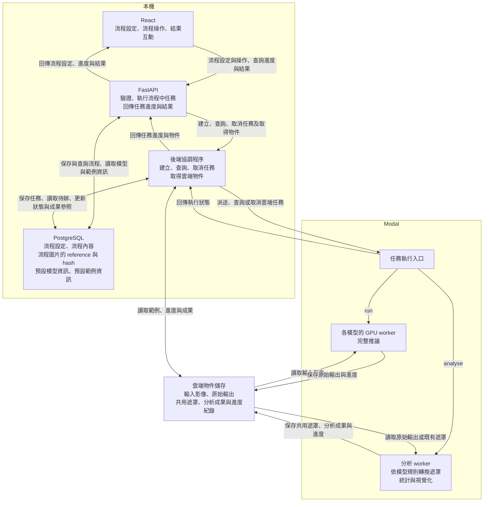

# 整體專案架構

## 技術架構

### 前端

- 語言與框架：TypeScript（strict）＋ React ＋ Vite
- UI：Tailwind CSS ＋ shadcn/ui
- 常用套件：React Router、TanStack Query、React Hook Form、Zod

### 後端

```text
React
  → FastAPI control plane
      ├─ PostgreSQL + JSONB
      ├─ S3-compatible object storage
      └─ Modal dispatcher
          ├─ model-specific GPU workers
          └─ CPU post-processing / visualization worker
```

- **FastAPI：** 保存流程設定，管理流程、run 與 analyse
- **PostgreSQL：** 保存模型與工具版本、範例影像 metadata；參數與推論、不確定度分析、整體報表內容與關係。
- **Object Storage：** 保存原始影像、模型輸出、共用遮罩與視覺化結果；針對影像與成果檔案，資料庫只存 reference 與 hash。
- **Modal：** 模型 worker 保存每次完整推論的原始輸出；CPU 分析 worker 依模型規則轉成共用遮罩，再統計並產生三種視覺化。

Control plane 使用 Python 3.12、FastAPI、Pydantic v2、SQLAlchemy 2、Alembic、psycopg 3。

## 目錄架構

以下為依 [README](../README.md) 與 [API 定義](api.md) 規劃的目錄，依畫面功能、流程管理與運算工作分工。

```text
XDDPMAPP/
├─ frontend/src/
│  ├─ app/              # 路由與全域設定
│  ├─ features/
│  │  ├─ flows/         # 流程建立、查詢、修改、刪除與步驟串接
│  │  │                 # 初始設定：選擇模型與適用範例、設定推論參數與 seed
│  │  ├─ runs/          # 所屬流程的推論操作、狀態與進度
│  │  ├─ analyses/      # 所屬流程的分析操作、狀態、進度與結果呈現
│  │  │  └─ viewer/     # 原圖對照、像素涵蓋比例熱圖、輪廓疊圖、分群代表圖與群比例
│  │  └─ reports/       # 請求產生與查看該流程的報表
│  └─ lib/api/          # 呼叫 FastAPI
├─ backend/app/
│  ├─ api/              # 模型資訊、適用範例、流程、run、analyse 與報表的 HTTP 入口及驗證
│  ├─ services/         # 模型與範例查詢、流程／run／analyse 管理、運算派送、狀態同步及報表彙整
│  ├─ db/               # 實體關係、設定、狀態、模型與工具版本、範例 metadata
│  │                    # 成果檔案只存 reference 與 hash，檔案本身放在物件儲存
│  └─ integrations/     # Modal 與物件儲存的連接
├─ backend/migrations/  # 建立或調整資料表、欄位與關聯的版本化腳本（Alembic）
├─ workers/
│  ├─ models/           # 五種模型各自的程式與獨立環境，對同一張影像執行多次完整推論
│  └─ analysis/         # 依模型輸出形成共用目標遮罩，再統計並產生三種視覺化
├─ contracts/           # 後端與 worker 交換的run/analyse資料格式
├─ scripts/             # 本機開發環境啟動與系統範例匯入
└─ docs/                # 需求、API、架構、模型與不確定度方法說明
```

前端的 `flows/` 負責串接整個操作流程，`runs/`、`analyses/` 與 `reports/` 各自處理其中的功能；`analyses/viewer/` 負責分析結果的圖像呈現與互動。這些資料夾不代表必須拆成不同頁面。

後端的 `services/` 負責管理流程與其 run／analyse、限制分析建立時機，以及彙整報表。文中的「任務」指 run 的推論工作或 analyse 的分析工作：後端建立對應紀錄，透過 `integrations/` 將運算派送到 Modal 上的 `workers/`，再將執行狀態與成果位置更新回紀錄。

`migrations/` 保存資料庫結構的修改步驟，讓已存在的資料庫能隨程式版本更新。例如，未來若要替流程增加「名稱」欄位，就用一個 migration 腳本新增該欄位；使用者平常建立一筆流程紀錄則由 `services/` 搭配 `db/` 處理。

## 架構位置

| 執行位置 | 元件與責任 |
|---|---|
| 本機 | React、FastAPI、PostgreSQL，負責操作畫面、任務管理與紀錄 |
| Modal | 各模型的推論 worker，以及後處理／視覺化 worker |
| 雲端物件儲存 | 輸入影像、原始推論輸出、遮罩與分析成果 |

## 分工



- FastAPI 接收操作要求並保存任務；本機後端的協調程序負責派送、同步雲端狀態及接續工作，位於 `backend/app/services/`，透過 `integrations/` 存取 Modal 與物件儲存。
- 每個模型有自己的接入模組與推論環境；分析 worker 依該模型的輸出規則轉換遮罩，三種視覺化讀取同一組遮罩。
- 系統範例由開發者透過 `scripts/` 匯入影像並登錄來源及適用模型；前端只提供選擇系統範例，沒有使用者上傳入口。
