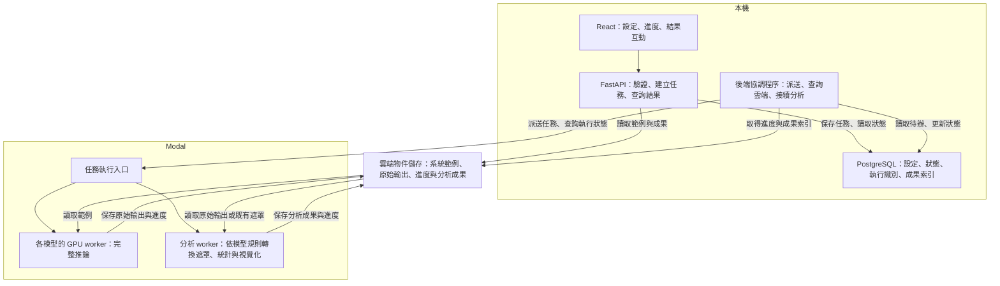

# 整體專案架構

```
XDDPMAPP/
├─ frontend/src/
│  ├─ app/              # 路由與全域設定
│  ├─ features/
│  │  ├─ setup/         # 模型、影像與初始參數
│  │  ├─ runs/          # 推論任務清單與進度
│  │  ├─ analyses/      # 分析設定與歷史結果
│  │  └─ viewer/        # 原圖、熱圖、輪廓與分群互動
│  └─ lib/api/          # 呼叫 FastAPI
├─ backend/app/
│  ├─ api/              # HTTP 入口與輸入驗證
│  ├─ services/         # 建立任務、同步雲端狀態、重試、取消及後續派送
│  ├─ db/               # 資料表與資料存取
│  └─ integrations/     # Modal 與物件儲存的連接
├─ backend/migrations/  # 資料庫結構變更
├─ workers/
│  ├─ models/           # 五種模型各自的程式與環境
│  └─ analysis/         # 遮罩轉換、統計、輪廓與分群
├─ contracts/           # worker 任務與成果的資料格式
├─ scripts/             # 本機開發環境啟動與系統範例匯入
└─ docs/
```

## 架構位置

| 執行位置 | 元件與責任 |
|---|---|
| 本機 | React、FastAPI、PostgreSQL，負責操作畫面、任務管理與紀錄 |
| Modal | 各模型的推論 worker，以及後處理／視覺化 worker |
| 雲端物件儲存 | 輸入影像、原始推論輸出、遮罩與分析成果 |

## 分工



- FastAPI 接收操作要求並保存任務；本機後端的協調程序負責派送、同步雲端狀態及接續工作，位於 `backend/app/services/`，透過 `integrations/` 存取 Modal 與物件儲存。
- 每個模型有自己的接入模組與推論環境；分析 worker 依該模型的輸出規則轉換遮罩，三種視覺化讀取同一組遮罩。
- 系統範例由開發者透過 `scripts/` 匯入影像並登錄來源及適用模型；前端只提供選擇系統範例，沒有使用者上傳入口。

## 本機協調與重啟後接續

1. **先保存，再派送。** 建立 run 時，將推論設定與首次分析設定保存至 PostgreSQL。協調程序將待執行工作送至已部署的 Modal worker，保存 Modal 執行識別（call ID）與對應的 run／analysis ID，供後續查詢與取消使用。
2. **本機主動同步。** 協調程序定期查詢 Modal 執行狀態，並讀取物件儲存中的進度與成果索引。worker 的進度紀錄包含目前階段及更新時間，推論 worker 另記錄已保存的完整樣本數；前端透過 FastAPI 查詢本機同步後的狀態。
3. **推論完成後接續一次分析。** 確認 N 份原始輸出已保存且可讀取後，將 run 標為 `COMPLETED`，再以保存的首次分析設定建立並派送 analysis。資料庫對「run 與首次 analysis 的關係」設唯一性限制；重複查詢或後端重啟時，沿用既有的首次 analysis，避免重複建立。失敗或成功取消的 run 不接續首次分析。
4. **重新開啟時先核對。** 本機後端關閉期間，已提交的 Modal 任務仍由雲端執行，狀態同步與尚未派送的後續工作則等待本機後端重新運行。啟動後先查詢已保存的 call ID、進度與成果，再更新紀錄及接續待辦。查詢逾時或短暫斷線時保留最後已知狀態與同步時間，不直接判定任務失敗或重送；派送結果不明時先核對遠端紀錄，避免重複運算。
5. **取消亦須同步確認。** 收到取消要求後，協調程序取消該任務的雲端工作，確認已停止後才寫入 `CANCELED`；尚未派送的工作則須先確認並阻止派送。已完成的 run 不因其後的 analysis 被取消而改變狀態。失敗或取消任務的重試會建立新任務，依 [API 規則](api.md) 執行。

## 重新分析的重算範圍與歷史保留

重新分析使用一個已完成 run 的原始輸出。異常偵測模型須保存每次完整推論的最終數值分數圖及必要座標資訊，分析 worker 才能套用新的 `final_anomaly_threshold` 產生遮罩。只有著色後的預覽圖或舊二值遮罩，不足以精確還原另一個門檻下的結果；缺少必要原始資料時回報資料缺失，由使用者決定是否重新推論。

| 修改內容 | 重算範圍與任務 |
|---|---|
| 最終異常門檻 `final_anomaly_threshold` | 建立新 analysis，對已保存的每份最終分數圖套用同一門檻，重建共用遮罩與三種視覺化；沿用原 run，不重新推論 |
| 分群設定或分群 seed | 建立新 analysis，沿用相同的遮罩、涵蓋比例與輪廓資料，重算分群、代表樣本與群比例；沿用原 run，不重新推論 |
| 同時修改最終異常門檻與分群設定 | 建立新 analysis，重建遮罩，再以新分群設定產生完整分析成果；不重新推論 |
| 模型版本、輸入範例、前處理、推論參數、樣本數或推論 seeds | 建立新 run，重新執行推論並接續分析；模型內部用來決定修補區域的門檻也屬於此類 |
| 縮放、透明度或單一樣本醒目顯示 | 前端更新顯示，不建立新分析任務 |

只有來源 run、目標、最終門檻、遮罩轉換規則／版本及座標設定一致時，才能共用原有遮罩與其衍生成果。新 analysis 明確引用共用 artifact；若遮罩來源或轉換規則改變，三種方法須改用新的同一組遮罩。結果清單與追溯欄位依 [api.md](api.md)。

- **每次提交建立新紀錄。** 保存新 analysis ID、來源 run、實際分析設定、分群 seed 與工具版本；保留舊 analysis 的設定及成果，不覆寫原有紀錄。共用未變動的 artifact 時保留其原始來源。
- **按鈕觸發分析。** 使用者修改數值時，畫面仍顯示上次結果及其已套用設定，另標示「設定尚未套用」；按下「重新分析」才提交新的 analysis。
- **完成後整組切換。** 分析期間保留上次完成的結果並顯示新任務進度；新 analysis 完成且所需資料載入後，一次切換遮罩、三種視覺化與設定標示，避免混用不同分析的資料。
- **失敗或取消保留舊成果。** 新 analysis 失敗或取消時，顯示該任務狀態，維持原本可查看的結果。使用者可切換歷史 analysis，或依 API 規則重試；合法空遮罩與群組不穩定的呈現依 [不確定度流程設計](xtool/uncertainty.md)。

## 操作流程

選擇模型
    ↓
選擇模型適用的範例
    ↓
設定推論參數
    ↓
開始推論
    ↓
進行不確定度分析
    ↓
查看結果 → 修改最終異常門檻／分群設定 → 按「重新分析」→ 完成後切換新結果
