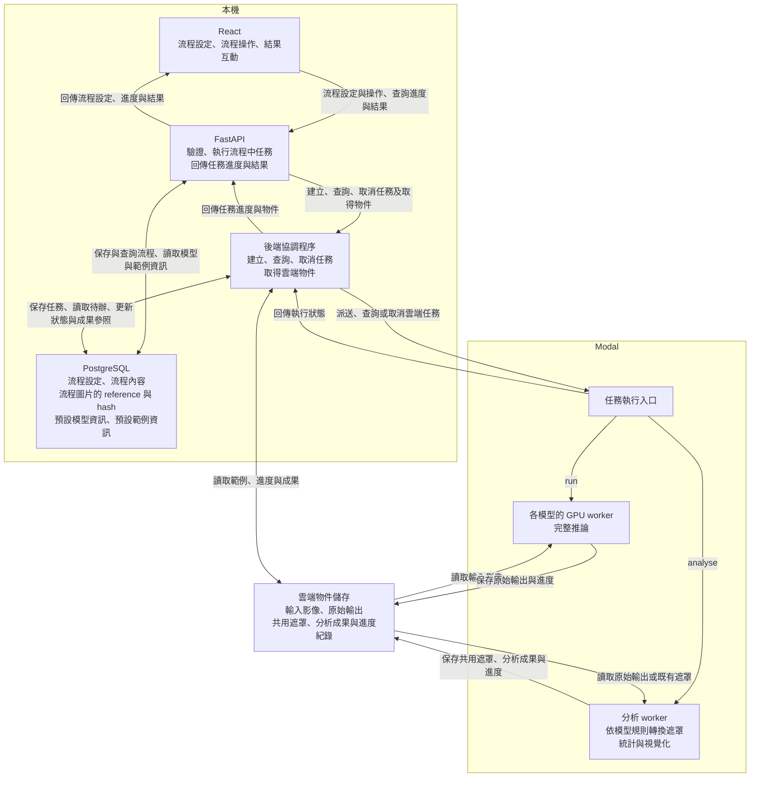

# 整體專案架構

## 服務架構流程

```
選擇模型與設定推論參數
    ↓
選擇模型適用的範例
    ↓
開始推論
    ↓
進行不確定度分析    
    ↓
查看結果與產生報表   
```

## 目錄架構

以下為依 [README](../README.md) 與 [API 定義](api.md) 規劃的目錄，依畫面功能、流程管理與運算工作分工。

以「流程實體」串起操作：流程保存選定模型、適用範例、推論參數與 random seed 設定，最多對應一個 run 與一個 analyse。所屬 run 完成後才可建立 analyse；兩者皆完成後，可彙整該流程的報表。

```text
XDDPMAPP/
├─ frontend/src/
│  ├─ app/              # 路由與全域設定
│  ├─ features/
│  │  ├─ flows/         # 流程建立、查詢、修改、刪除與步驟串接
│  │  │                 # 初始設定：選擇模型與適用範例、設定推論參數與 seed
│  │  ├─ runs/          # 所屬流程的推論操作、狀態與進度
│  │  ├─ analyses/      # 所屬流程的分析操作、狀態、進度與結果呈現
│  │  │  └─ viewer/     # 原圖對照、像素涵蓋比例熱圖、輪廓疊圖、分群代表圖與群比例
│  │  └─ reports/       # 請求產生與查看該流程的報表
│  └─ lib/api/          # 呼叫 FastAPI
├─ backend/app/
│  ├─ api/              # 模型資訊、適用範例、流程、run、analyse 與報表的 HTTP 入口及驗證
│  ├─ services/         # 模型與範例查詢、流程／run／analyse 管理、運算派送、狀態同步及報表彙整
│  ├─ db/               # 實體關係、設定、狀態、模型與工具版本、範例 metadata
│  │                    # 成果檔案只存 reference 與 hash，檔案本身放在物件儲存
│  └─ integrations/     # Modal 與物件儲存的連接
├─ backend/migrations/  # 建立或調整資料表、欄位與關聯的版本化腳本（Alembic）
├─ workers/
│  ├─ models/           # 五種模型各自的程式與獨立環境，對同一張影像執行多次完整推論
│  └─ analysis/         # 依模型輸出形成共用目標遮罩，再統計並產生三種視覺化
├─ contracts/           # 後端與 worker 交換的run/analyse資料格式
├─ scripts/             # 本機開發環境啟動與系統範例匯入
└─ docs/                # 需求、API、架構、模型與不確定度方法說明
```

前端的 `flows/` 負責串接整個操作流程，`runs/`、`analyses/` 與 `reports/` 各自處理其中的功能；`analyses/viewer/` 負責分析結果的圖像呈現與互動。這些資料夾不代表必須拆成不同頁面。

後端的 `services/` 負責管理流程與其 run／analyse、限制分析建立時機，以及彙整報表。文中的「任務」指 run 的推論工作或 analyse 的分析工作：後端建立對應紀錄，透過 `integrations/` 將運算派送到 Modal 上的 `workers/`，再將執行狀態與成果位置更新回紀錄。

`migrations/` 保存資料庫結構的修改步驟，讓已存在的資料庫能隨程式版本更新。例如，未來若要替流程增加「名稱」欄位，就用一個 migration 腳本新增該欄位；使用者平常建立一筆流程紀錄則由 `services/` 搭配 `db/` 處理。

## 架構位置

| 執行位置 | 元件與責任 |
|---|---|
| 本機 | React、FastAPI、PostgreSQL，負責操作畫面、任務管理與紀錄 |
| Modal | 各模型的推論 worker，以及後處理／視覺化 worker |
| 雲端物件儲存 | 輸入影像、原始推論輸出、遮罩與分析成果 |

## 分工



- FastAPI 接收操作要求並保存任務；本機後端的協調程序負責派送、同步雲端狀態及接續工作，位於 `backend/app/services/`，透過 `integrations/` 存取 Modal 與物件儲存。
- 每個模型有自己的接入模組與推論環境；分析 worker 依該模型的輸出規則轉換遮罩，三種視覺化讀取同一組遮罩。
- 系統範例由開發者透過 `scripts/` 匯入影像並登錄來源及適用模型；前端只提供選擇系統範例，沒有使用者上傳入口。

## 本機協調與重啟後接續

1. **先保存，再派送。** 流程建立時，先將選定模型、適用範例、推論參數與 random seed 設定保存至 PostgreSQL。開始推論時，建立所屬流程的 run，狀態設為 `QUEUED`，由協調程序依流程設定派送到對應模型的 GPU worker。analyse 也須先建立紀錄，再派送到 CPU 分析 worker。兩種任務均保存 Modal 執行識別（call ID）與對應的實體 ID，供後續查詢與取消使用。
2. **本機主動同步。** 協調程序定期查詢 Modal 執行狀態，並讀取物件儲存中的進度與成果索引，再更新 PostgreSQL 中的任務紀錄。進度包含目前階段及更新時間，推論另記錄已保存的完整推論輸出數量；前端透過 FastAPI 取得同步後的狀態與進度。
3. **完成推論後才可建立分析。** 確認指定次數的完整推論均已完成，且原始輸出已保存並可讀取後，才將 run 標為 `COMPLETED`。建立 analyse 時，`services/` 檢查它與來源 run 屬於同一流程，且 run 已完成。資料庫以關聯與唯一性限制，確保每個流程最多一個 run、一個 analyse；重複請求或後端重啟不另建第二筆實體。
4. **重新啟動時先核對既有任務。** 本機後端停止期間，無法同步狀態或派送待辦。重新啟動後，協調程序先依已保存的 call ID 查詢雲端狀態、進度與成果，更新既有紀錄，再處理確認尚未派送的工作。查詢逾時或短暫斷線時，保留最後已知狀態與同步時間；派送結果不明時先核對遠端紀錄，避免直接判定失敗或重複派送。
5. **取消須確認停止。** 收到執行中任務的取消要求後，先寫入 `CANCELING`，再透過 `integrations/` 請求取消雲端工作，確認已停止後才寫入 `CANCELED`。尚未派送的任務須先阻止派送，再確認取消。run 失敗或取消後不可建立 analyse；analyse 失敗或取消不改變已完成 run 的狀態。

## 任務狀態

run 與 analyse 各自使用 [API 定義](api.md) 的六種 `status`。狀態描述任務的執行情形，進度則描述目前階段與已完成的工作量。

| 狀態 | 意義 |
|---|---|
| `QUEUED` | 任務已建立，等待派送或等待 worker 開始執行 |
| `RUNNING` | worker 正在執行推論或分析 |
| `COMPLETED` | 工作已完成，所需成果已保存並確認可讀取 |
| `FAILED` | 任務執行失敗，保存失敗原因供前端顯示 |
| `CANCELING` | 已提出取消要求，等待確認工作停止 |
| `CANCELED` | 已確認工作停止，或已阻止尚未派送的工作 |

## 推論輸出與不確定度分析

`workers/models/` 為 DermoSegDiff、AutoDDPM、cDAL、CCDM、THOR 提供各自的接入模組與獨立環境。run 使用固定模型權重，依流程設定對同一張 2D 範例影像執行多次完整推論，將每次原始輸出保存到物件儲存。

`workers/analysis/` 讀取所屬 run 的原始輸出，依模型規則形成共用目標遮罩。AutoDDPM 與 THOR 須依各自模型的固定門檻轉換最終異常分數圖，同一 analyse 內的每份分數圖均套用相同門檻；cDAL 的目標為肺野或細胞核。遮罩形成後，CPU worker 使用同一組遮罩產生全部三種視覺化：

| 分析成果 | 呈現內容 |
|---|---|
| 像素涵蓋比例熱圖 | 各像素在多次完整推論中被目標遮罩涵蓋的比例 |
| 輪廓疊圖 | 多次完整推論的遮罩輪廓，用於比較邊界差異 |
| CDclust 分群、代表圖與群比例 | 遮罩的分群結果、各群代表圖及各群占全部樣本的比例 |

共用遮罩與三種視覺化成果均保存至物件儲存；PostgreSQL 保存所屬流程、run、analyse 的關聯、實際執行設定、模型與工具版本，以及檔案的 reference 與 hash。`contracts/` 定義後端與 worker 交換的任務資料及成果參照格式。確認遮罩與三種視覺化成果皆已保存且可讀取後，才將 analyse 標為 `COMPLETED`。

## 結果呈現與報表

`frontend/src/features/flows/` 串接流程設定與各步驟，`runs/` 與 `analyses/` 顯示各自的狀態及進度。分析完成後，`analyses/viewer/` 將選定範例的原圖與分析結果一起呈現，並確保三種視覺化來自該流程的同一個 analyse 與同一組共用遮罩。圖表的解讀方式依 [不確定度流程設計](xtool/uncertainty.md)。

同一流程的 run 與 analyse 皆為 `COMPLETED` 後，才可產生報表。前端 `reports/` 向 FastAPI 提出請求，由 `services/` 彙整流程設定、模型與範例資訊、推論結果及三種不確定度視覺化，再提供前端查看。報表中的設定與圖像須對應該流程實際執行並保存的紀錄。
