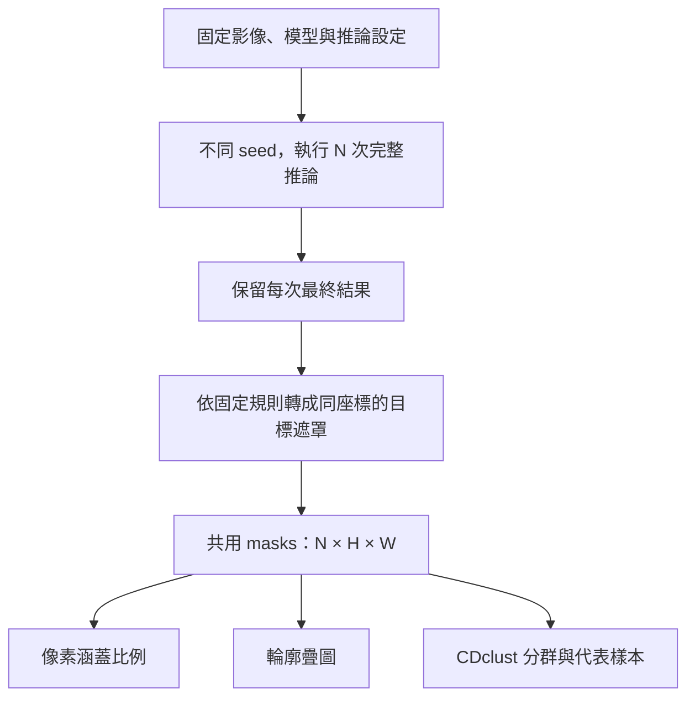

# 五個模型的視覺化不確定度流程設計

## posterior 定義

本文的 posterior 指：固定輸入、模型權重與推論設定，使用不同隨機雜訊完成多次推論，得到的最終結果集合。圖上的比例表示這個生成程序下的樣本比例。

三種方法真正共用的輸入應是**同一組目標遮罩**。因此，通用設計是「各模型負責產生結果及轉換遮罩，共用後端負責統計與畫圖」。cDAL 只涵蓋 2D 肺野與細胞核。

## 2. 各模型是否適合

下表是依作者的輸出與抽樣流程作出的適用性判斷。

| 模型／任務 | 方法一：涵蓋比例熱圖 | 方法二：輪廓疊圖 | 方法三：CDclust |
|---|---|---|---|
| **DermoSegDiff** | **適合**。每輪可產生皮膚病灶遮罩，直接統計像素涵蓋比例。 | **適合**。能呈現同一病灶的邊界位移。 | **有條件適合**。若有不同形狀模式可摘要；只有小幅邊界抖動時，未必需要分成多群。[取樣程式](https://github.com/xmindflow/DermoSegDiff/blob/main/src/reverse/reverse_process.py) |
| **CCDM** | **適合**。原本就以同一影像的多種分割結果為建模目標。 | **適合**。可呈現不同標註型態的邊界分歧。 | **有條件適合，且最符合其多模態用途**。但可能生成空遮罩，須另外處理。[原論文](https://arxiv.org/html/2303.08888v5) |
| **cDAL：肺野** | **適合**。統計的是肺野涵蓋比例，目標不是病灶。 | **適合**。能觀察肺野邊界變化。 | **有條件適合**。可用完整雙肺遮罩分群，但群組描述的是肺野形狀模式。[官方程式](https://github.com/Hejrati/cDAL/blob/master/train_cDal_monu_and_lung.py) |
| **cDAL：細胞核** | **適合**。可顯示哪些位置穩定被判為細胞核。 | **適合，但可能擁擠**。許多細胞核同時疊圖時，需要放大局部觀察。 | **有條件適合**。可對整張細胞核聯集遮罩分群；若要解釋「某一顆核有哪些可能形狀」，還需要跨樣本的物件對應。[官方評估程式](https://github.com/Hejrati/cDAL/blob/master/metrics.py) |
| **AutoDDPM** | **轉成遮罩後適合**。每輪最終異常分數用固定門檻轉成二值結果。 | **轉成遮罩後適合**。邊界變化同時受到重建與門檻影響。 | **有條件適合**。異常區域須有可比較的空間結構；大量零碎誤報可能使群組難以解讀。[輸出程式](https://github.com/ci-ber/autoDDPM/blob/main/model_zoo/ddpm.py) |
| **THOR** | **轉成遮罩後適合**。使用每輪完整流程彙整出的最終異常圖。 | **轉成遮罩後適合**。可呈現最終定位範圍的變化。 | **有條件適合**。與 AutoDDPM 相同；不能把同輪不同時間步的異常圖當成多份樣本。[原論文](https://arxiv.org/html/2403.08464v1) |

**CDclust 的限制主要來自遮罩集合，而非模型名稱。** 它用面積包含關係衡量中心程度，容許輪廓相交；但從其公式可推知，若所有遮罩互不重疊，包含程度都接近零，就無法表達位置相距多遠。多物件遮罩中的微小變化也可能被大面積結構掩蓋。因此它適合探索形狀群組，不能保證找出真實的 posterior 模態數。[CDclust 原論文](https://onlinelibrary.wiley.com/doi/10.1111/cgf.15083)

## 3. 共用的 posterior 準備步驟

1. **固定分析單位與設定。**  
   每組樣本對應一個模型、一個 checkpoint、一張影像及一種目標結構。固定前處理、sampler、步數、guidance 與後處理；不同模型、fold 或噪聲設定各自建立樣本集。

2. **使用模型原本的隨機初始化方式。**  
   DermoSegDiff、cDAL 使用原生連續噪聲；CCDM 使用 categorical 隨機標籤；AutoDDPM、THOR 則依原流程對輸入影像加噪。**通用的是抽樣控制介面，初始狀態不必全部改成同一種 Gaussian noise。** [DermoSegDiff](https://github.com/xmindflow/DermoSegDiff/blob/main/src/reverse/reverse_process.py)、[CCDM](https://arxiv.org/html/2303.08888v5)、[AutoDDPM](https://arxiv.org/html/2305.19643v1)

3. **每個 seed 跑完一次完整流程。**  
   保留原生推論途中的隨機性，每輪取得一份最終結果。DermoSegDiff 要取軌跡末端；cDAL 要保留跨輪平均之前的結果；AutoDDPM 每轮包含初始遮罩建立及後續修補；THOR 每輪完成時間步彙整。

4. **逐樣本轉成目標遮罩。**  
   分割模型沿用其解碼與類別定義；異常偵測模型使用最終分數圖及預先選定的固定門檻。門檻可依模型／任務不同，但同一組樣本及三種視覺化必須一致。保留原始輸出，方便追溯遮罩來源。

5. **統一座標並快取。**  
   共用介面輸出 `masks[N, H, W]`，型別為 boolean，另存原始結果、sample ID、seed、模型設定、門檻與座標轉換。三種方法讀取這份快取。不要為了讓輪廓重合而額外配準樣本。

6. **檢查樣本量是否足夠。**  
   可先以 32 份試跑，再增加到 64、128 份，比較熱圖與群組是否穩定；這些是工程起點，不是充分性保證。保留合法的空遮罩與重複遮罩，它們的出現次數也是分布資訊。

## 4. 三種方法各自的接續步驟

**方法一：像素涵蓋比例熱圖**

對共用遮罩 \(M_1,\ldots,M_N\)，計算：

\[
\widehat p(u)=\frac{1}{N}\sum_{s=1}^{N}M_s(u).
\]

沿樣本軸取平均，將結果以固定的 0–1 色階疊在原圖上。空遮罩仍計入分母。

它適合回答「哪些位置經常被圈入」。**高涵蓋比例不等於高不確定度**：接近 0 或 1 表示樣本一致，接近 0.5 才表示前景／背景分歧最大。這張圖也無法單獨表達不同位置如何一起變動。

**方法二：輪廓疊圖**

從每份共用遮罩擷取完整邊界，以一致線寬及透明度疊在原圖上；保留多個連通區域及孔洞邊界，並標示空遮罩比例。

輪廓密集重合的位置表示邊界穩定，散開的位置表示形狀或位置有變化。它保留完整樣本的形狀資訊，但樣本或細胞核太多時容易遮蔽，因此提供縮放與單一樣本醒目顯示。線條深淺不直接標成可信區間。

**方法三：CDclust 分群、代表圖與群比例**

1. 記錄空遮罩數量；將非空遮罩送入 eID／CDclust。每次完整遮罩是一份樣本，多個病灶或細胞核仍保留在同一份樣本內。
2. 比較候選群數與多次隨機初始化的 ReD，**候選必須包含一群**；同時檢查重跑後的群組是否穩定。ReD 支持的是啟發式推薦，不保證最佳或真實群數。
3. 每群選擇**群內 eID 最高的實際樣本**作代表，回連其原始結果；以該群顏色顯示輪廓。
4. 顯示各群 \(n_g/N\)，並另列空遮罩比例 \(n_{\emptyset}/N\)，所有比例加總為 1。
5. 若沒有可辨識的包含結構，或不同初始化導致明顯不同分群，顯示「群組不穩定」，保留前兩種圖供觀察。[方法定義](https://onlinelibrary.wiley.com/doi/10.1111/cgf.15083)、[作者視覺化範例](https://github.com/chadepl/contour-depth/blob/main/boxplot_demo.py)

## 5. 驗證情境與實作預設

- **全部遮罩相同：** 熱圖只有 0／1、輪廓重合，分群摘要為一種形狀。
- **混有空遮罩：** 三種結果使用相同總樣本數；空結果不造成 CDclust 除以零。
- **兩種已知形狀及固定比例：** 檢查熱圖計算、輪廓對應、群比例與代表樣本索引。
- **多物件、孔洞及互不重疊遮罩：** 檢查邊界完整性，並確認 CDclust 的不足會被呈現。
- **重現性與加量：** 相同設定及 seed 可重現結果；增加樣本時記錄摘要的變化。

本規劃以 2D、固定模型權重、各模型原生推論為預設。三種圖呈現的是指定生成程序下的結果變異；目前適用性依論文及程式靜態查核判斷，尚未實際執行模型驗證。
